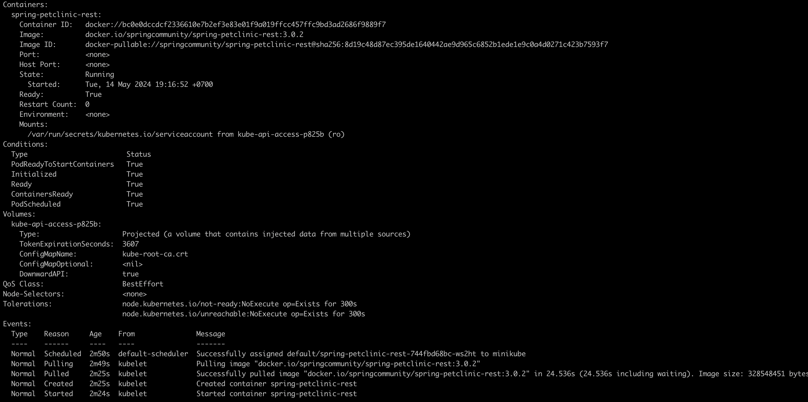

### Reflection Tutorial 11

# 11.1 Compare the Application logs before and after you exposed it as a service. Try to open the app several times while the proxy is running, what do you see in the logs? Does the number of logs increase each time you open the app?

Saat mengexpose dengan kubectl, pod/service akan dapat diakses dari luar cluster. Ini membuat aplikasi bisa diakses. Saat membuka aplikasi beberapa kali saat proxy berjalan, kita bisa melihat bahwa logs menambah dengan request GET/ yang dilakukan dari web browser. ini bertambah setiap kali aplikasi dibuka.

# 11.2 Notice that there are two version of `kubectl get` invocation during this tutorial section. the first does not have any option, while the latter has the `-n` option with value set to `kube-system`. What is the purpose of this option? and why did the output not list the pods that you created?

opsi `-n` mengspesifikasi "namespace" yang ingin diakses resourcenya. saat kita menggunakan `-n kube-system`, kita mengakses resource yang ada di namespace kube-system. Karena pod yang kita buat tidak ada di namespace kube-system, maka pod yang kita buat tidak terlihat. `kube-system` sendiri merupakan namespace yang digunakan oleh kubernetes untuk menyimpan resource yang menjalankan system-level services.

# 11.3 What is the difference between Rolling Update and Recreate deployment strategy?

Rolling Update adalah strategi update deployment yang dilakukan dengan mengganti pod satu persatu. Pod yang lama akan dihapus dan diganti dengan pod yang baru. Strategi ini memungkinkan aplikasi tetap berjalan saat update dilakukan. Sedangkan Recreate adalah strategi update deployment yang dilakukan dengan menghapus semua pod lama dan membuat pod baru. Strategi ini membuat aplikasi tidak bisa diakses saat update dilakukan.

# 11.4 Try deploying the app using the Recreate strategy. Document it. 

Initial state deployment dari tutorial, saya akan mencoba mengupdate image ke versi yang lama "3.2.1" -> "3.0.2"

Pertama saya akan scale down replica menjadi 0
dengan perintah `kubectl scale deployment spring-petclinic-rest --replicas=0`

Kemudian saya akan update image ke versi "3.0.2"

Lalu saya akan scale up replica menjadi 4 kembali
dengan perintah `kubectl scale deployment spring-petclinic-rest --replicas=4`

Hasil akhir, deployment berhasil diupdate dengan image versi "3.0.2" 

# 11.5 Prepare different manifest files for executing Recreate deployment strategy.
`recreate-deployment.yaml`

# 11.6 What do you think the benefits of using kubernets manifest files are?

menggunakan kubernets manifest files memungkinkan user untuk langsung mendefenisikan aksi yang kita ingin lakukan dan langkah-langkahnya dengan secara konsisten dan dengan dokumentasi yang baik. YAML file juga memungkinkan automasi untuk melalkukan berbagai hal, seperti script. mengedit hal-hal yang berhubungan dengan konfigurasi juga semudah dengan mengedit file YAML. Berbagai opsi dalam YAML file juga memungkinkan user untuk melakukan konfigurasi yang lebih spesifik.
